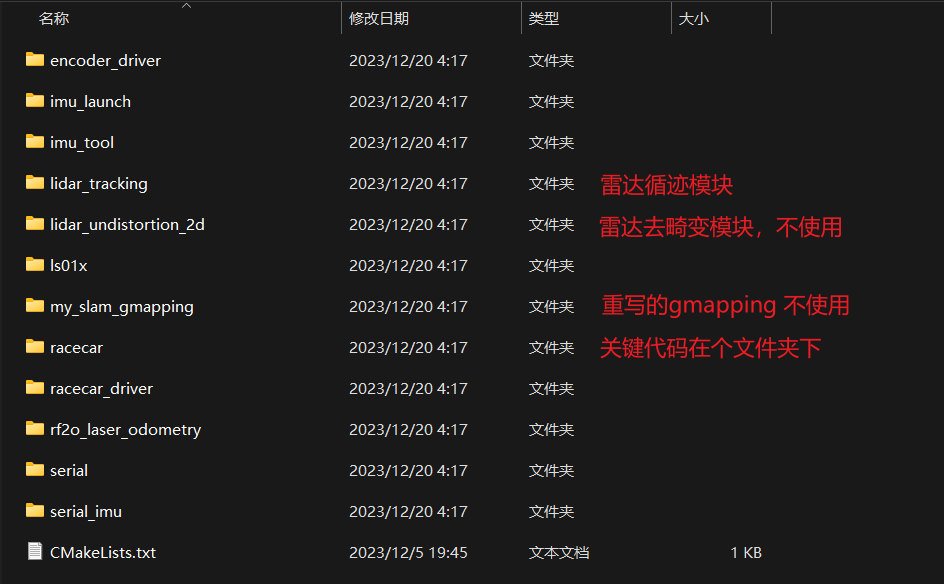
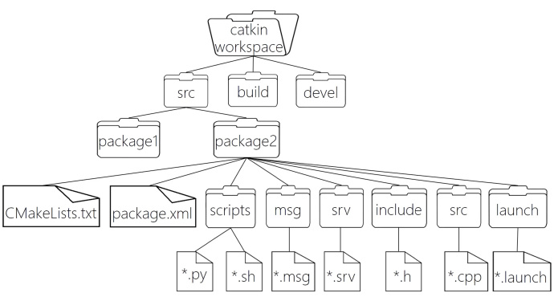
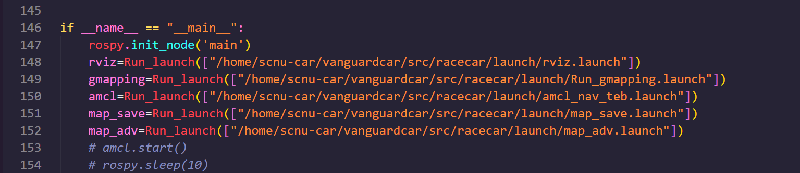
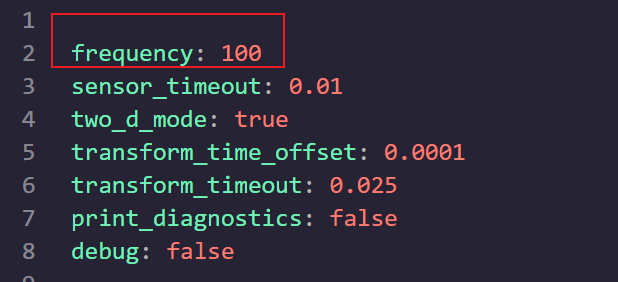
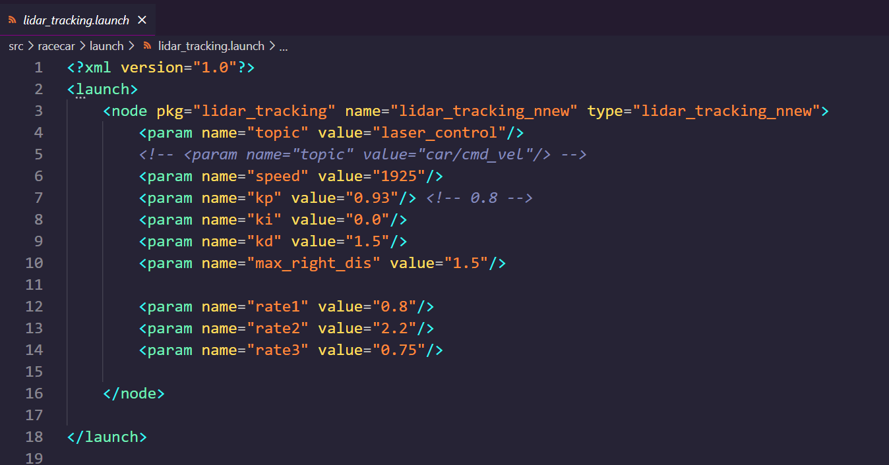
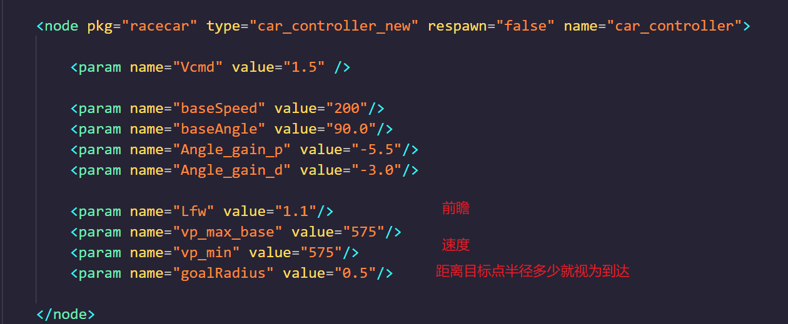

[TOC]

# 使用说明


## 文件说明

### 文件说明

**实验源码**文件夹存放的是与技术报告有关的代码，为区域赛时所写，国赛时并未更新


**代码**文件夹存放了三份代码

这里的速度均指第一圈的速度，第二圈导航的速度为2075，时间大约为11s

**x1850**为低速版保底代码，第一圈（包含停车的3s）时间大约为30s

**x1925**为高速版本，第一圈时间为24s

**planB**为备用方案，当第二圈导航无法正常使用时，使用这个方案。这个方案两圈都是跑雷达循迹

---


### src文件夹的内容



---


**my_slam_gmapping**重写的gmapping，只是当时测试的残留，在实际代码中并未使用到，不用关注，如果你要研究

链接：[我手写了个SLAM算法！ - 知乎 (zhihu.com)](https://zhuanlan.zhihu.com/p/296268303)

[给gmapping加激光雷达运动畸变去除模块 - 知乎 (zhihu.com)](https://zhuanlan.zhihu.com/p/309691861)

---

lidar_undistortion_2d**雷达去畸变模块，测试残留，在实际代码中并未使用到

链接：[LiuLimingCode/lidar_undistortion_2d (github.com)](https://github.com/LiuLimingCode/lidar_undistortion_2d)

---

### racecar文件夹的内容


launch文件夹与src文件夹里的内容最关键


### launch文件夹的内容


### racecar/src下的内容


## 复现说明

1.最基础的准备工作：按照官方配置好小车


2.导航用的算法是TEB算法，具体内容情况技术手册

请根据手册配置好teb模块


3.将任意一份代码复制到主目录下，编译

下图是ros的文件系统层级



4.编译完成后，source一下工作空间

5.修改下面的路径为自己的真实路径



6.打开1个终端，输入`roslaunch racecar Run_car.launch`启动小车的传感器

7.在src/racecar/src下打开一个终端，输入`python3 stop.py`，不要回车，这个是停车的脚本，当小车失控乱跑的时候才回车使用，这里只是做好准备

8.确保小车电调处于关闭状态，在src/racecar/src下再打开一个终端，输入`python3 auto_nav.py`回车，即可运行。等待所有东西加载完毕后，打开电调，小车就能跑了


## 技术手册

国赛版与区域赛版主要区别在雷达循迹算法的优化上，增强了其抗光性能，进而提升了鲁棒性


## 速度快但建图好的关键

提高ekf融合发布频率

param下的ekf_params.yaml，适当提高frequency




## 循迹相关参数的调节： 



① rate1~rate3 是从近到远 3 对锥桶的误差计算权重，循迹在 1925 以下速度的基本不需要再改动了，速度快了才考虑适当加大 rate2和 rate3。 

② max_left_dis 不改动，max_right_dis 代表雷达循迹能扫描到的 右边的锥桶的最大 x 方向距离，目前 max_right_dis 的值为 1.5， 除非现场确实出现很大的互相影响，否则不再减小 max_right_dis 了，如果发现他找不到靠右边的桶可以适当加大一些。 

③ **最重要的就是 PID 的 kp 和 kd 参数**，这是最可能要修改的两个参数了，当发现小车转不过弯适当增大 kp 值，因为参数做了归一化， 所以小小的 kp 就会有大大的影响，特别是小车能跑只是贴外圈而 已，增大 kp 值的时候可以**每次增大 0.05 进行尝试**，相反如果是 太贴内圈肯定降低 kp 会好，入弯反应慢或者直道摆动严重对采点 影响大，还是建议玄学调调，最后一次调试的时候发现增大 kd 好 像对减小抖动帮助不大，反而降低 kd 之后直道稳一些。 

④ 有一个参数，就是 middle_angle，目前 1925/1850 版本使用的是 84（每辆车的舵机中值可能有差别），正常情况下这是不该改的，但如果为了让小车在速度快的时候 提前拐大弯，因为两个大弯都是左转，所以适当增大 middle_angle 是可以的，虽然不合理，但我们试过了确实有奇效。 


## 导航相关参数的调节

在amcl_nav_teb.launch中




## 最关键的代码是auto_nav.py

细读代码与手册


## 解耦调试

如果只要调试雷达循迹，只需要将topic改为car/cmd_vel，即注释第四行，解注释第5行

修改后：


开启小车传感器

```shell
roslaunch racecar Run_car.launch
```

开启雷达循迹

```shell
roslaunch racecar lidar_tracking.launch
```

记得准备好`stop.py`随时停车


**如果要耦合调试**，**记得修改回来**


## 经验总结

多调试！

---

最后，祝取得好成绩！

